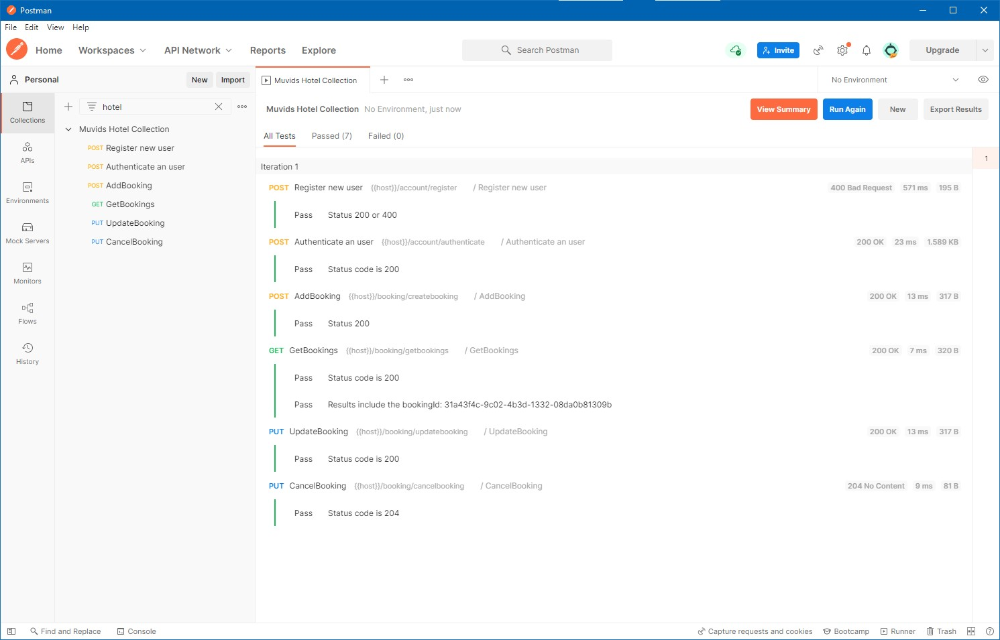

 

 


<!-- PROJECT LOGO -->
<br />
<div align="center">
  <a href="https://github.com/helibertoarias/muvids">
    
  </a>

  <h3 align="center"Muvids Web API</h3>
 


</div>
<!-- TABLE OF CONTENTS -->
<details>
  <summary>Table of Contents</summary>
  <ol>
    <li>
      <a href="#about-the-project">About The Project</a>
      <ul>
        <li><a href="#built-with">Built With</a></li>
      </ul>
    </li>
    <li>
      <a href="#getting-started">Getting Started</a>
      <ul>
        <li><a href="#prerequisites">Prerequisites</a></li>
        <li><a href="#installation">Installation</a></li>
      </ul>
    </li>
    <li><a href="#usage">Usage</a></li>
    <li><a href="#contact">Contact</a></li>
   
  </ol>
</details>


<!-- ABOUT THE PROJECT -->
## About The Project

This is a Web API for handling users and reservations in the Muvids hotel.

<p align="right">(<a href="#top">back to top</a>)</p>


### Built With

This Web API has build using ASP.NET Core Web API using .NET 6.0. This project presents an elegant architecture using CQRS combine with Mediator Pattern. 

You can use Postman to run the collection of requestd included into this repository. 

Some of the Nuget Packages used here are:

- Entity Framework Core for SQL Server
- Autommaper
- Serilog
- Fluent Validation
- MediatR
- Asp.Net Core Authentication
- Newtonsoft
- Swashbuckle
 
<p align="right">(<a href="#top">back to top</a>)</p>


<!-- GETTING STARTED -->
## Getting Started

Here some steps to run the application.


### Prerequisites

- Visual Studio 2020 
- SDK .NET 6
- SQL Server Express 2019 or other version will works.

### Installation

_To start using the application you should._

1. Clone the repo.
   ```sh
   git clone https://github.com/helibertoarias/MuvidsHotel.git
   ```
2. Open the solution MuvidsHotel.sln and build to restore the Nuget Packages.
3. Set the project Muvids.Web.API as startup project.
4. Open the file ./Muvids.Web.API/appsettings.json and update the user and password. This API use two databases, one called MuvidsHotel for the application and other called MuvidsIdentity for the users.
    ```json
    "ConnectionStrings": {
      "MuvidsHotelConnectionString": "Server=localhost;Database=MuvidsHotel;User Id=<user>;Password=<password>",
      "MuvidsIdentityConnectionString": "Server=localhost;Database=MuvidsIdentity;User Id=<user>;password=<password>" }
     ```
5. In VS 2020 open a new terminal Package Manager Console, select as defaul project *src\Infrastructure\Muvids.Persistence* and create the database for the application.
    ```cmd
    Update-Database -Context MuvidsDbContext
     ```
6. Now, for the user's database, in the same terminal, select *src\Infrastructure\Muvids.Identity* and run the following command.
    ```cmd
    Update-Database -Context MuvidsIdentityDbContext
     ```
6. After this you can run the application. The Swaggepage will show up
 [https://localhost:7098/swagger/index.html](https://localhost:7098/swagger/index.html)


<p align="right">(<a href="#top">back to top</a>)</p>


<!-- USAGE EXAMPLES -->
## Usage

To validate the Web API you need to import the file **Muvids Hotel Collection.postman_collection.json** into [POSTMAN](https://www.postman.com/downloads/) and run the test collection. 

Here some screenshots.

   - Select the imported file and hit the *Run* button.

   <br />
   
  <br /> <br />


 
   - After a seconds you should see all test pass.

   <br />
   

   - Notes: By default, only one room was created, the id for it is "c9d4c053-49b6-410c-bc78-2d54a9991850". This roomId will be required to add a new booking. Be aware that you will need to update the fields *start* and *end* in order to meet those requirements.
       1. All reservations start at least the next day of booking.
       2. The stay can’t be longer than 3 days and can’t be reserved more than 30 days in advance.
       3. To access to the endpoints you require authentication. Take a look to the "Authenticate an user" method once you import the collection into Postman.


   <br />
   

 
<p align="right">(<a href="#top">back to top</a>)</p>


<!-- CONTACT -->
## Contact

Heliberto Arias - [@helibertoarias](https://twitter.com/helibertoarias) - helibertoarias@gmail.com

Project Link: [https://github.com/helibertoarias/MuvidsHotel](https://github.com/helibertoarias/muvidshotel)

<p align="right">(<a href="#top">back to top</a>)</p>


 
 
